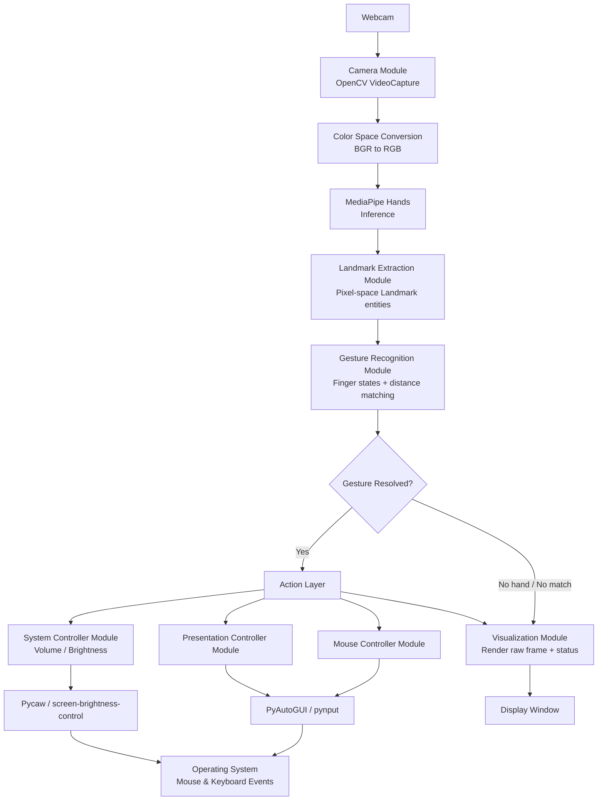
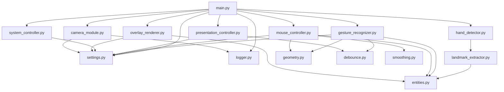
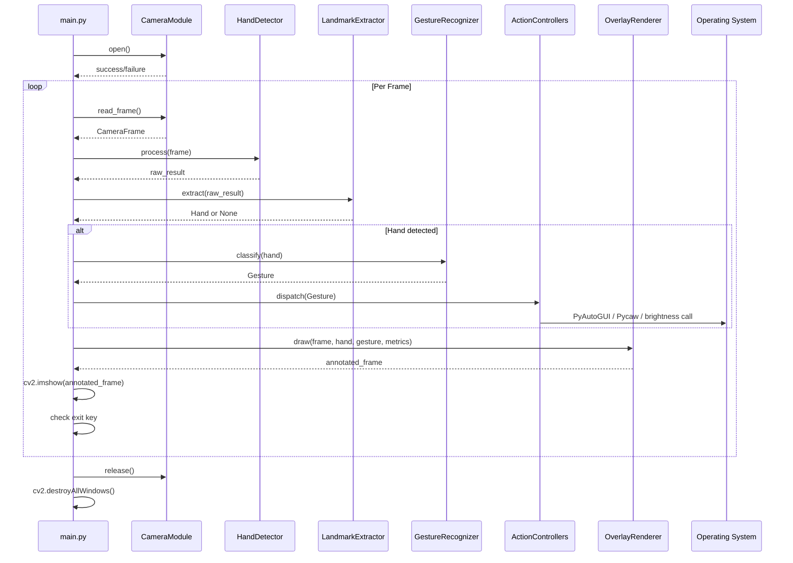

# Architecture.md — Technical Architecture

## Virtual AI Mouse – Gesture Controlled System

---

## 1. Project Structure
Virtual-AI-Mouse/

│

├── main.py                          # Application entry point; orchestrates the main loop

├── config/

│   └── settings.py                  # Centralized constants: thresholds, gesture maps, key bindings

│

├── core/

│   ├── camera_module.py             # Camera Module: capture device lifecycle

│   ├── hand_detector.py             # Hand Detection Module: MediaPipe wrapper

│   ├── landmark_extractor.py        # Landmark Extraction Module

│   ├── gesture_recognizer.py        # Gesture Recognition Module

│   ├── mouse_controller.py          # Mouse Controller Module

│   ├── presentation_controller.py   # Presentation Controller Module

│   └── system_controller.py         # Volume/Brightness Module (optional features)

│

├── visualization/

│   └── overlay_renderer.py          # Visualization Module: landmarks, FPS, bounding box, labels

│

├── utils/

│   ├── geometry.py                  # Distance calculation, interpolation helpers

│   ├── smoothing.py                 # Cursor smoothing algorithms

│   ├── debounce.py                  # Gesture persistence / debounce timers

│   └── logger.py                    # Centralized logging configuration

│

├── models/

│   └── entities.py                  # Data model classes: Hand, Landmark, Gesture, Cursor, etc.

│

├── tests/

│   ├── test_gesture_recognizer.py

│   ├── test_geometry.py

│   ├── test_smoothing.py

│   └── mocks/

│       └── mock_camera.py           # Hardware mocks for testing without physical webcam

│

├── images/                          # Documentation assets

├── demo.mp4                         # Demo recording

├── requirements.txt

├── README.md

├── PRD.md

├── SRS.md

├── Architecture.md

└── AGENTS.md

> Note: The flat structure shown in early prototyping (`HandTrackingModule.py`, `MouseController.py`, `GestureRecognizer.py` at root) is acceptable for a minimal proof-of-concept, but the structure above is the **production-target layout** referenced throughout this document and enforced by `AGENTS.md`.

---

## 2. High-Level Architecture

The system follows a **layered pipeline architecture**, where each layer consumes the output of the previous layer and produces a well-defined output for the next. This is intentionally similar to a data-processing pipeline rather than a request-response service, since the application's core loop is a continuous, frame-driven cycle.

**Layers:**

1. **Acquisition Layer** — Camera Module. Owns the video capture device lifecycle.
2. **Perception Layer** — Hand Detection + Landmark Extraction Modules. Wraps MediaPipe; converts raw model output into structured entities.
3. **Interpretation Layer** — Gesture Recognition Module. Converts landmark geometry into semantic gesture labels.
4. **Action Layer** — Mouse Controller, Presentation Controller, System Controller. Converts gesture labels into OS-level side effects.
5. **Presentation Layer** — Visualization Module. Renders diagnostic and user-facing overlays.
6. **Cross-Cutting Layer** — Configuration, Utilities, Logging. Used by every other layer but owned by none.

---

## 3. Mermaid Diagram — High-Level Flow

---

## 4. Mermaid Diagram — Module Dependency Graph

**Dependency notes:**
- `entities.py` (data model) is a leaf dependency consumed by multiple modules but depends on nothing else — this enforces a clean, acyclic data layer.
- `config/settings.py` is depended upon by nearly every module, by design — it is the single source of truth for tunables, satisfying the "never hardcode" principle from `AGENTS.md`.
- `geometry.py`, `smoothing.py`, and `debounce.py` are pure-function utility modules with no side effects, making them trivially unit-testable.
- No module in the Action Layer depends on another Action Layer module — `mouse_controller.py`, `presentation_controller.py`, and `system_controller.py` are siblings, not dependents of each other, preserving separation of concerns.

---

## 5. Module Responsibilities

| Module | Responsibility | Depends On | Does NOT Do |
|--------|------------------|-------------|---------------|
| `camera_module.py` | Open/close capture device, read frames, expose `CameraFrame` | `config`, `logger` | Image processing, gesture logic |
| `hand_detector.py` | Run MediaPipe inference on a frame | `mediapipe` | Geometry math, action execution |
| `landmark_extractor.py` | Convert MediaPipe output → `Hand`/`Landmark` entities | `entities` | Gesture classification |
| `gesture_recognizer.py` | Classify finger states, compute distances, resolve `Gesture` | `entities`, `geometry`, `debounce`, `config` | Execute OS actions |
| `mouse_controller.py` | Coordinate mapping, smoothing, PyAutoGUI invocation | `geometry`, `smoothing`, `config`, `entities` | Gesture recognition logic |
| `presentation_controller.py` | Map slide-nav gestures to key events | `config`, `debounce` | Mouse movement logic |
| `system_controller.py` | Map distance values to volume/brightness | `config` | Gesture recognition |
| `overlay_renderer.py` | Draw landmarks, FPS, bounding boxes, labels | `entities`, `config` | Any business logic / state mutation |
| `geometry.py` | Distance calculation, coordinate interpolation | — | Stateful logic |
| `smoothing.py` | Exponential smoothing functions | — | Coordinate mapping |
| `debounce.py` | Frame-persistence / cooldown tracking | — | Gesture classification |
| `entities.py` | Data model class definitions | — | Behavior/logic |
| `settings.py` | Centralized constants and gesture mapping table | — | Runtime logic |

---

## 6. Data Flow
[Webcam Hardware]

│  raw frames

▼

[Camera Module] ───────────────► CameraFrame

│

▼

[Hand Detection Module] ───────► MediaPipe raw results

│

▼

[Landmark Extraction Module] ──► Hand { landmarks: List[Landmark] }

│

▼

[Gesture Recognition Module] ──► Gesture (label, confidence, persistence)

│

├──► [Mouse Controller]         ──► Cursor (smoothed) ──► PyAutoGUI ──► OS

├──► [Presentation Controller]  ──► Key Event           ──► OS

└──► [System Controller]        ──► Volume/Brightness   ──► OS Audio/Display API

│

▼

[Visualization Module] ────────► Annotated CameraFrame ──► Display Window

Each arrow represents a **unidirectional, per-frame data handoff**. No module reaches "backward" into a prior stage; all communication is via explicitly returned data structures, not shared mutable global state (with the narrow, documented exception of `Cursor` previous-position and debounce timers, which are intentionally stateful across frames).

---

## 7. Processing Pipeline (Per-Frame Sequence)

1. `camera_module.read_frame()` → `CameraFrame`
2. `hand_detector.process(frame)` → raw MediaPipe result
3. `landmark_extractor.extract(result, frame.width, frame.height)` → `Hand` or `None`
4. If `Hand` is `None`: skip to step 8 (render raw frame, no action).
5. `gesture_recognizer.classify(hand)` → `Gesture`
6. `debounce.confirm(gesture)` → confirmed `Gesture` or `None` (suppressed if not yet persisted)
7. Dispatch confirmed gesture to the appropriate controller (`mouse_controller`, `presentation_controller`, or `system_controller`) based on `GestureAction.action_type`.
8. `overlay_renderer.draw(frame, hand, gesture, metrics)` → annotated frame
9. `cv2.imshow(...)` → display annotated frame
10. Check exit key; if pressed, break loop and proceed to cleanup.

---

## 8. Class Responsibilities

### `CameraModule`
- `open() -> bool`
- `read_frame() -> CameraFrame`
- `release() -> None`
- **Responsibility:** owns the `cv2.VideoCapture` handle exclusively; no other class touches it directly.

### `HandDetector`
- `process(frame: CameraFrame) -> RawDetectionResult`
- **Responsibility:** thin wrapper around `mediapipe.solutions.hands.Hands`; performs no coordinate-space conversion.

### `LandmarkExtractor`
- `extract(raw_result, frame_width: int, frame_height: int) -> Optional[Hand]`
- **Responsibility:** converts MediaPipe's normalized [0,1] coordinates into pixel-space `Landmark` entities and assembles a `Hand`.

### `GestureRecognizer`
- `compute_finger_states(hand: Hand) -> List[int]`
- `classify(hand: Hand) -> Gesture`
- **Responsibility:** pure interpretation logic; stateless aside from delegated debounce tracking.

### `MouseController`
- `move_cursor(landmark: Landmark) -> None`
- `click(button: str) -> None`
- `drag(start: bool) -> None`
- `scroll(delta: int) -> None`
- **Responsibility:** owns the `Cursor` entity's previous-position state and all PyAutoGUI invocations related to mouse behavior.

### `PresentationController`
- `next_slide() -> None`
- `previous_slide() -> None`
- **Responsibility:** translates gestures into keyboard events scoped to presentation navigation only.

### `SystemController`
- `set_volume(distance: float) -> None`
- `set_brightness(distance: float) -> None`
- **Responsibility:** wraps optional third-party libraries; must fail gracefully if unavailable.

### `OverlayRenderer`
- `draw(frame, hand, gesture, metrics) -> CameraFrame`
- **Responsibility:** purely additive rendering; never mutates application state.

### `DebounceTracker`
- `confirm(gesture: Gesture) -> Optional[Gesture]`
- **Responsibility:** tracks consecutive-frame persistence per gesture label; returns `None` until the persistence threshold is met.

---

## 9. Sequence of Operations (Startup → Shutdown)

---

## 10. Layer Explanations

### Acquisition Layer
Responsible solely for interfacing with the physical webcam through OpenCV. It abstracts away device indices, resolution configuration, and failure handling, exposing only a clean `CameraFrame` to upper layers. This isolation is what enables hardware mocking in tests (see `AGENTS.md` §"Mocking Hardware Dependencies").

### Perception Layer
Wraps MediaPipe's pretrained hand-landmark model. This layer is intentionally "dumb" — it does not interpret gestures, it only detects geometry. Keeping detection and interpretation separate allows the gesture vocabulary to evolve (new gestures, new thresholds) without ever touching the perception code.

### Interpretation Layer
The semantic core of the application. It receives geometric primitives (landmark coordinates) and produces meaning (a `Gesture` label). All gesture vocabulary lives here and in `config/settings.py` — never duplicated elsewhere, per the DRY principle enforced in `AGENTS.md`.

### Action Layer
Translates semantic gestures into real-world side effects. Each controller in this layer is independently swappable: removing `system_controller.py` (e.g., on a non-Windows OS where Pycaw is unavailable) does not affect mouse or presentation control.

### Presentation Layer
Exists purely for human feedback and debugging — bounding boxes, FPS, gesture labels. It has zero influence on the actual control logic; disabling it would not change application behavior, only visibility.

### Cross-Cutting Layer
`config/settings.py`, `utils/logger.py`, and the generic helpers in `utils/` are consumed horizontally across all vertical layers. This is the layer most directly governed by the "never hardcode" and "centralized configuration" rules.

---